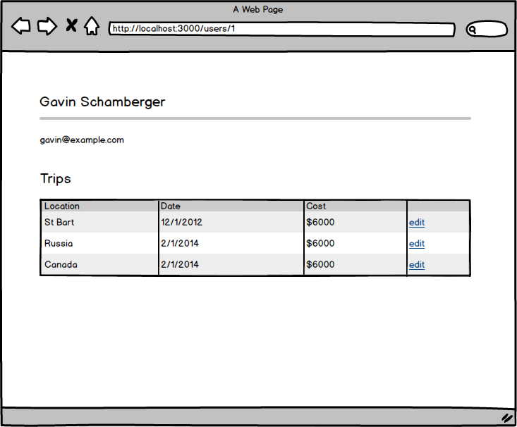
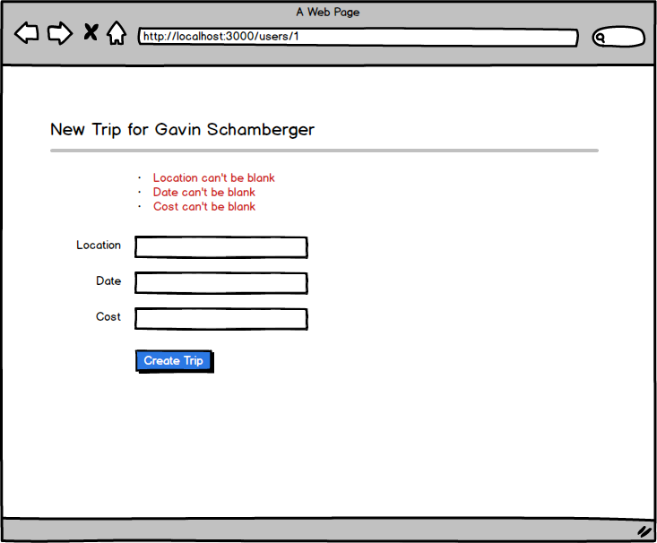

## Users can take trips

You work at a travel agency.  Part of your job is to track where your clients have gone, and when.

Your goal is to create a nested resource for Trips under the User resource.

**Users can view the users show page**

```
When I go to the users index page
And I click on the user's name
Then I should see a user's show page
```

**Users can add a trip to a user**

```
When I go to the users show page
And I click "New Trip"
Then I should be able to fill in the location, date and cost
And when I create the trip, I should be able to see it on the user's show page
And I should see a flash message
```

**Users can edit and delete trips**

```
When I go to the users show page
I should see a link to edit trips
And I should be able to edit / update a trip
And from the edit page I should be abel to delete a trip
```

**Users must enter all fields**

```
When I go to the trip create / edit form
And I submit the form without filling in any fields
Then I should see validation errors
```




